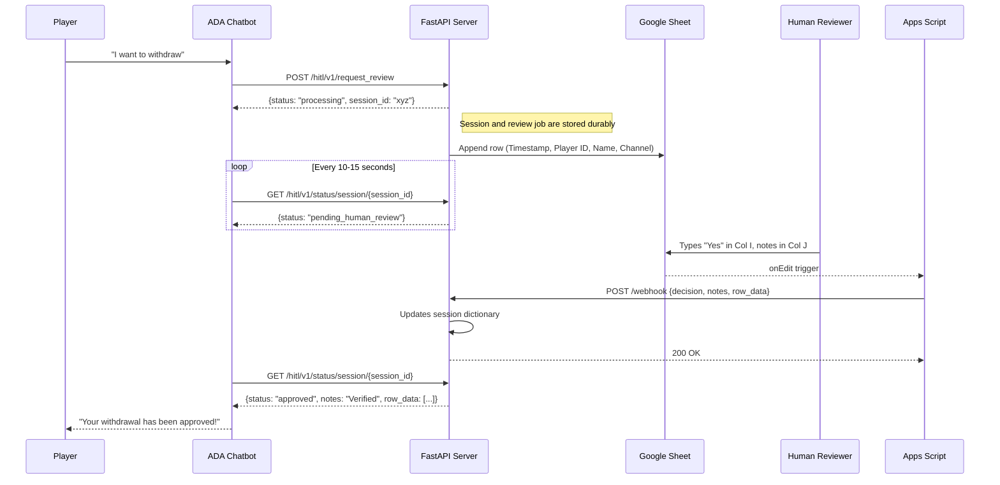

# HITL Payment Automation — FastAPI + Google Sheets

  

## Overview


This system delivers **end-to-end withdrawal automation** - from the moment a player requests a withdrawal in the chatbot, to the final decision being relayed back, with zero manual data entry in between.

- **Fast & Durable**: The request path persists session and job state immediately, then dedicated workers process Google Sheets writes without blocking ADA.
- **Chatbot-native**: Players initiate withdrawals directly through the ADA chatbot — no context switching for the player or the agent.
- **Instant dashboard logging**: Every request is appended to the HITL Google Sheet with player details, backend GMT+2 timestamps, and session tracking.
- **Human-only decisions**: The system routes the requests and **never** approves or rejects a payment automatically — that authority stays with the human reviewer.
- **Real-time feedback loop**: The moment a reviewer types their decision, the chatbot is updated within seconds via an automated webhook pipeline.
- **Full audit trail**: Every request, decision, and note is captured with timestamps — ready for compliance and reporting.
- **Concurrent & resilient**: Session state survives restarts, review jobs are recoverable, and writes avoid full-sheet scans as volume grows.

---

## Architecture

### Sequence Flow



---

## Reliability Features

This system is designed so that **zero withdrawal requests are missed or skipped**, even under high concurrency:

| Feature                           | File                      | Description                                                                                                                     |
| --------------------------------- | ------------------------- | ------------------------------------------------------------------------------------------------------------------------------- |
| **Sheets Retry**            | `sheets_service.py`     | Exponential backoff covers both HTTP failures and transient transport errors such as Windows socket aborts.                    |
| **Thread-Local Sheets Client Cache** | `sheets_service.py` | Reuses a cached Sheets client per thread with a TTL, avoiding cross-thread reuse of `httplib2.Http()` without rebuilding the client on every call. |
| **Sheets Concurrency Limit** | `sheets_service.py` | Limits concurrent Sheets API calls with a semaphore so worker bursts and reconciliation reads do not overwhelm API quota. |
| **Atomic Sheets Append**    | `sheets_service.py`     | Uses a single `values.append` call instead of scanning `A5:K` to find the next row.                                           |
| **Durable Session Store**   | `session_store.py`      | Persists session status in SQLite so polling, webhook updates, and restarts stay in sync.                                      |
| **Durable Review Queue**    | `main.py`               | Review jobs are queued in SQLite and claimed by worker tasks, so requests are recoverable after restarts.                      |
| **Reconciliation Cooldown** | `main.py` | Pending sessions reconcile from Google Sheets only after a per-session cooldown, preventing polling traffic from exhausting read quota. |
| **SQLite Tuning** | `session_store.py` | WAL mode plus `busy_timeout`, cache sizing, memory-mapped I/O, and cleanup indexing improve durability and performance under concurrency. |
| **Backend Timestamping**    | `sheets_service.py`     | The API writes Column B directly in GMT+2, removing the expensive Apps Script full-sheet `onChange` scan.                               |
| **Webhook Retry**           | `apps_script.js`        | Apps Script retries up to 3x with exponential backoff if the webhook fails.                                                    |
| **Timing-Safe Webhook Auth** | `main.py` | The webhook secret is validated with `hmac.compare_digest()` instead of a simple string comparison. |
| **Operational Metrics**     | `main.py`               | `/metrics` exposes queue depth, worker counts, session status counts, and review job outcomes.                                |

---

## Security Model

| Layer                            | Implementation                                                                                     |
| -------------------------------- | -------------------------------------------------------------------------------------------------- |
| **Webhook Authentication** | Shared secret (`WEBHOOK_SECRET`) in HTTP header, validated by FastAPI middleware                 |
| **Sheets API Auth**        | Service account with narrow scope (`spreadsheets` only) — no OAuth user consent needed          |
| **Credential Management**  | All secrets in `.env` (gitignored), service account key in `service_account.json` (gitignored) |
| **CORS**                   | Configurable middleware — restrict to specific domains in production                              |
| **Input Validation**       | Pydantic models enforce strict typing on all request payloads                                      |

---

## Quick Start
1. Clone & Setup Venv. Install requirements.
2. Copy `.env.example` to `.env` and fill in the current runtime values.
3. Share the Google Sheet with the service account email as an Editor.
4. Run `python main.py`
5. Expose localhost with ngrok: `ngrok http 8000`

## Production Notes
- Keep `REQUIRE_SERVICE_ACCOUNT=true` in production so writes never fall back to API-key mode.
- Put `SESSION_DB_PATH` on a durable disk path that survives restarts and deployments.
- Tune `REVIEW_WORKER_COUNT` carefully against Google Sheets quota rather than CPU core count.
- Keep `SHEETS_API_CONCURRENT_LIMIT` aligned with your Sheets API quota and review worker count.
- Keep `SHEETS_CLIENT_TTL_SECONDS` high enough to avoid unnecessary client rebuild churn, but low enough that auth/config changes roll through predictably.
- Tune `RECONCILIATION_COOLDOWN_SECONDS` high enough that ADA polling cannot turn into sustained Sheets read pressure.
- Set `CORS_ALLOW_ORIGINS` to the exact ADA domains you expect instead of `*`.
- Only the Apps Script `onEdit` trigger is required now; backend writes Column B timestamps directly in GMT+2.

## Recommended Profiles

The values in `.env.example` are demo-oriented starter defaults. If you want clearer operational profiles while keeping Google Sheets as the review surface, use the following starting points.

| Profile | Use case | REVIEW_WORKER_COUNT | REVIEW_WORKER_IDLE_SLEEP_SECONDS | REVIEW_JOB_VISIBILITY_TIMEOUT_SECONDS | SHEETS_API_CONCURRENT_LIMIT | SHEETS_CLIENT_TTL_SECONDS | RECONCILIATION_COOLDOWN_SECONDS |
| --- | --- | ---: | ---: | ---: | ---: | ---: | ---: |
| `demo` | Shareholder demo, low concurrent pending volume | 4 | 0.5 | 300 | 5 | 300 | 15 |
| `pilot` | Controlled rollout with moderate pending volume | 4 | 0.5 | 600 | 3 | 600 | 60 |
| `enterprise-on-sheets` | Higher-volume production while keeping Google Sheets as the reviewer UI | 4 | 1.0 | 900 | 2 | 900 | 180 |

### Profile Notes
- `REVIEW_WORKER_COUNT` should not scale linearly with traffic. Google Sheets quota is the real constraint, so adding more workers mainly increases burst pressure.
- `SHEETS_API_CONCURRENT_LIMIT` is only a concurrency cap. It reduces burst intensity but does not guarantee a fixed requests-per-minute ceiling.
- `RECONCILIATION_COOLDOWN_SECONDS` is the most important safety control for polling-heavy setups. Higher values reduce fallback freshness but protect Sheets read quota.
- `enterprise-on-sheets` assumes the Apps Script webhook is the primary state-sync path and that reconciliation from Google Sheets is a fallback, not the main flow.
- These are starting profiles, not guaranteed limits. Validate them against your actual Google Workspace edition, Sheets quota, and real pending-session behavior.

### Quick Math
- With a default Sheets read quota of about `300/min`, the maximum continuously pending sessions supported by reconciliation is roughly `5 * RECONCILIATION_COOLDOWN_SECONDS`.
- Example: `15s` supports about `75` continuously pending sessions before read pressure becomes dangerous.
- Example: `60s` supports about `300` continuously pending sessions.
- Example: `180s` supports about `900` continuously pending sessions.

## Deployment Checklist
- Copy `.env.example` to `.env` and set `SPREADSHEET_ID`, `SHEET_NAME`, `SERVICE_ACCOUNT_PATH`, and `WEBHOOK_SECRET`.
- Keep `REQUIRE_SERVICE_ACCOUNT=true` anywhere the app must append to Google Sheets.
- Share the target spreadsheet with the configured service account as an Editor.
- Point `SESSION_DB_PATH` to a durable disk location for any environment that should survive restarts.
- Set `CORS_ALLOW_ORIGINS` to the exact ADA domains you expect; only enable `ALLOW_CREDENTIALS=true` with explicit origins.
- Tune `REVIEW_WORKER_COUNT`, `SHEETS_API_CONCURRENT_LIMIT`, and `RECONCILIATION_COOLDOWN_SECONDS` to match expected traffic and Google Sheets quota.
- Update `apps_script.js` with the active `/webhook` URL and the same `WEBHOOK_SECRET` value.
- Install the Apps Script `onEdit` trigger and confirm the `ErrorLog` sheet is empty after a test run.
- Verify `/health`, `/metrics`, one end-to-end append, and one end-to-end human decision before presenting the demo.

### Testing
```powershell
# 1. Submit a withdrawal with Name and Channel
Invoke-RestMethod -Uri "http://localhost:8000/hitl/v1/request_review" `
  -Method Post `
  -Headers @{"Content-Type"="application/json"} `
  -Body '{"player_id":"P100", "player_name":"Batuhan", "channel":"Chat"}'

# 2. Extract session_id from response

# 3. Go to Google Sheets and simulate human review:
#   - Column B timestamp is written automatically in GMT+2
#   - Decision (Column I) = 'Yes'
#   - Notes (Column J) = 'Verified manually'

# 4. Poll status
Invoke-RestMethod -Uri "http://localhost:8000/hitl/v1/status/session/YOUR_SESSION_ID"
```

## Tools Available
Run `python test_concurrent.py` to exercise the durable queue path with burst or staggered request loads.
