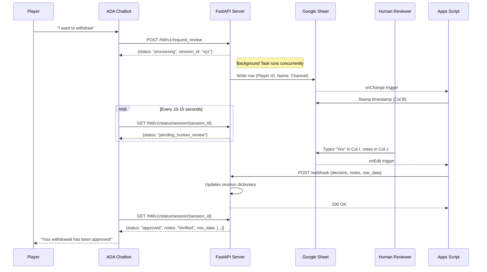

# HITL Payment Automation — FastAPI + Google Sheets

  

## Overview


This system delivers **end-to-end withdrawal automation** — from the moment a player requests a withdrawal in the chatbot, to the final decision being relayed back, with zero manual data entry in between.

- **Fast & Asynchronous**: Built with FastAPI Background Tasks to ensure sub-10ms response times for the chatbot, eliminating webhook timeouts.
- **Chatbot-native**: Players initiate withdrawals directly through the ADA chatbot — no context switching for the player or the agent.
- **Instant dashboard logging**: Every request is automatically written to the HITL Google Sheet with player details, timestamps, and session tracking.
- **Human-only decisions**: The system routes the requests and **never** approves or rejects a payment automatically — that authority stays with the human reviewer.
- **Real-time feedback loop**: The moment a reviewer types their decision, the chatbot is updated within seconds via an automated webhook pipeline.
- **Full audit trail**: Every request, decision, and note is captured with timestamps — ready for compliance and reporting.
- **Concurrent & resilient**: Tested under simultaneous withdrawal requests with zero data loss.

---

## Architecture

### Sequence Flow



---

## Reliability Features

This system is designed so that **zero withdrawal requests are missed or skipped**, even under high concurrency:

| Feature                           | File                      | Description                                                                                                                     |
| --------------------------------- | ------------------------- | ------------------------------------------------------------------------------------------------------------------------------- |
| **Sheets Retry**            | `sheets_service.py`     | Exponential backoff (up to 5 retries) for Sheets API 429/5xx errors.                                                            |
| **Thread-Safe Singleton**   | `sheets_service.py`     | Double-checked locking prevents race conditions during Sheets API client initialization.                                        |
| **Lock-Protected Append**   | `sheets_service.py`     | Employs a Python Semaphore/Lock to prevent concurrent Sheets appends from writing over each other.                               |
| **Asynchronous Handoff**    | `main.py`               | Uses FastAPI `BackgroundTasks` to instantly respond to the Chatbot to prevent connection timeout.                           |
| **Webhook Retry**           | `apps_script.js`        | Apps Script retries up to 3× with exponential backoff if the webhook fails.                                                    |
| **Dead-Letter Logging**     | `apps_script.js`        | Failed webhooks after all retries are logged to a dedicated `ErrorLog` sheet tab — no human decision is ever silently lost.  |
| **Operational Metrics**     | `main.py`               | `/metrics` endpoint tracks request counts, success/failure rates, and uptime for monitoring.                                  |

---

## Security Model

| Layer                            | Implementation                                                                                     |
| -------------------------------- | -------------------------------------------------------------------------------------------------- |
| **Webhook Authentication** | Shared secret (`WEBHOOK_SECRET`) in HTTP header, validated by FastAPI middleware                 |
| **Sheets API Auth**        | Service account with narrow scope (`spreadsheets` only) — no OAuth user consent needed          |
| **Credential Management**  | All secrets in `.env` (gitignored), service account key in `service_account.json` (gitignored) |
| **CORS**                   | Configurable middleware — restrict to specific domains in production                              |
| **Input Validation**       | Pydantic models enforce strict typing on all request payloads                                      |

---

## Quick Start
1. Clone & Setup Venv. Install requirements.
2. Ensure you have the `.env` file populated.
3. Configure your Google Service Account logic in `.env`.
4. Run `python main.py`
5. Expose localhost with ngrok: `ngrok http 8000`

### Testing
```powershell
# 1. Submit a withdrawal with Name and Channel
Invoke-RestMethod -Uri "http://localhost:8000/hitl/v1/request_review" `
  -Method Post `
  -Headers @{"Content-Type"="application/json"} `
  -Body '{"player_id":"P100", "player_name":"Batuhan", "channel":"Chat"}'

# 2. Extract session_id from response

# 3. Go to Google Sheets and simulate human review:
#   - Decision (Column I) = 'Yes'
#   - Notes (Column J) = 'Verified manually'

# 4. Poll status
Invoke-RestMethod -Uri "http://localhost:8000/hitl/v1/status/session/YOUR_SESSION_ID"
```

## Tools Available
Run `python test_concurrent.py` to test the new Asynchronous logic for enterprise queues.
