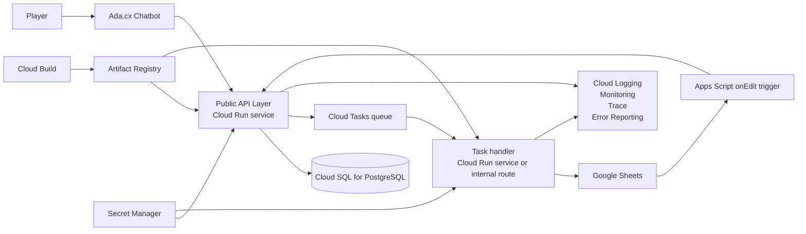

# Google Cloud Enterprise Migration Guide

## HITL Withdrawal Automation Demo

This document explains how to migrate this project from a laptop-hosted FastAPI demo into a Google Cloud enterprise architecture while keeping Google Sheets as the near-term human review surface.

This is a planning guide only. It does not require code changes now.

## 1. Executive Summary

The current manual workflow has two unnecessary human handoffs:

1. A player asks Ada.cx about withdrawal status.
2. The chatbot hands the player to a human customer support agent.
3. The customer support agent manually enters the player ID into Google Sheets.
4. A human payment agent reviews the withdrawal request.
5. The payment agent fills the Decision and Notes columns.
6. The customer support agent informs the player.

The goal of this automation is to remove steps 2, 3, and 6 from the operational flow while keeping step 4 manual.

The near-term target state is:

1. The player asks Ada.cx directly.
2. Ada.cx calls a Google Cloud-hosted backend.
3. The backend creates the review case automatically and appends it into Google Sheets.
4. The human payment agent still reviews inside Google Sheets.
5. When the payment agent fills Decision and Notes, the backend receives the result automatically.
6. Ada.cx gives the player the final answer without customer-support re-entry.

This gives the company a credible shareholder demo because it preserves the existing Google Sheets review behavior while demonstrating real automation, auditability, scalability, security, and enterprise readiness on Google Cloud.

## 2. Scope and Constraints

### In scope

- Keep Google Sheets as the near-term review interface for payment agents.
- Keep the human payment-agent decision step manual.
- Move hosting, secrets, state, async processing, logging, monitoring, and deployment to Google Cloud.
- Prepare a migration path that is suitable for a shareholder demo first and enterprise rollout second.

### Out of scope for this phase

- Replacing Google Sheets with a custom internal reviewer portal.
- Adding AI decisioning to payment approvals.
- Re-architecting Ada.cx itself.
- Making production code changes now.

## 3. Recommended Target Operating Model

Google Sheets should remain the human review surface, but not the system of record.

Recommended principle:

- Cloud SQL should become the source of truth for sessions, review jobs, webhook outcomes, and audit data.
- Google Sheets should become the operational queue and reviewer UI.
- Ada.cx should interact with the backend, not with human customer support for data entry.

That distinction matters. Google Sheets is acceptable as a near-term interface. It is not a suitable primary database for enterprise control, recovery, analytics, or audit reporting.

## 4. Target Architecture

### Why this architecture fits the use case

- Cloud Run is the right public compute layer for Ada.cx and Apps Script webhooks.
- Cloud Tasks is the right async layer for durable, rate-limited, retryable Google Sheets writes.
- Cloud SQL is the right system of record for session state, job state, and auditability.
- Secret Manager removes local `.env` and JSON key handling from runtime.
- Cloud Logging and Monitoring make the shareholder demo measurable and enterprise-ready.
- Artifact Registry and Cloud Build provide a credible enterprise delivery story.

## 5. Current-to-Future Service Mapping

| Current component | Google Cloud target | Why it matters | Future library or tool |
| --- | --- | --- | --- |
| Local FastAPI app | Cloud Run | Managed HTTPS hosting, autoscaling, revision rollouts, no VM management | `uvicorn`, Cloud Run runtime |
| `ngrok` tunnel | Cloud Run URL or custom domain behind HTTPS load balancer | Removes local tunnel dependency | Cloud Run, optional Load Balancer |
| In-memory state / local DB | Cloud SQL for PostgreSQL | Durable session state, restart recovery, auditability | `cloud-sql-python-connector`, `sqlalchemy`, `pg8000` or `psycopg` |
| Background task logic | Cloud Tasks + Cloud Run task handler | Durable async processing, rate limiting, retries, deduplication | `google-cloud-tasks` |
| `.env` secrets | Secret Manager | Central secret control, rotation, audit logs | `google-cloud-secret-manager` |
| `service_account.json` on disk | Attached Cloud Run service account using ADC | Removes long-lived key files from runtime | `google-auth` |
| Console logs | Cloud Logging + Error Reporting | Centralized structured logs and aggregated failures | `google-cloud-logging` |
| Local metrics | Cloud Monitoring + log-based metrics + custom metrics | Dashboards, alerting, operational reporting | `google-cloud-monitoring`, OpenTelemetry |
| Manual deploys | Cloud Build + Artifact Registry + optional Cloud Deploy | Repeatable and governed deployments | Cloud Build triggers |
| Google Sheet as both queue and history | Google Sheet as queue only, Cloud SQL as source of truth | Better control, analytics, and recovery | Sheets API remains |

## 6. Recommended Google Cloud Services

### Core migration services

These are the services that should be in the first real migration wave:

1. Cloud Run
2. Cloud Tasks
3. Cloud SQL for PostgreSQL
4. Secret Manager
5. Artifact Registry
6. Cloud Build
7. Cloud Logging
8. Cloud Monitoring
9. Error Reporting
10. Cloud Trace
11. IAM and service accounts
12. Cloud Audit Logs

### Strongly recommended enterprise add-ons

These are not strictly required for the first demo implementation, but they are the right enterprise controls to present in the roadmap:

1. External HTTPS Load Balancer and Cloud Armor
2. Cloud Deploy for controlled promotion across environments
3. Cloud Scheduler for scheduled cleanup, reconciliation, and archiving jobs
4. Cloud Run Jobs for admin, archive, and reconciliation tasks
5. BigQuery for audit and operational analytics
6. Looker Studio or Looker dashboards for executive reporting
7. Cloud KMS / CMEK for data-at-rest controls where required
8. VPC Service Controls if the organization already uses service perimeters
9. Security Command Center if the company already standardizes on it organization-wide

### Optional API management layer

If the company already uses API management as a standard pattern:

- Use Apigee in front of Cloud Run if centralized partner API governance, monetization, or advanced policy control already exists in the enterprise.
- Use API Gateway if a lighter gateway layer is preferred.

If neither is already standard, a shareholder demo can still be credible with Cloud Run plus custom domain, Cloud Armor, and strict service-account based internal access.

## 7. Recommended Google Libraries and Tooling

These are the most relevant Python packages and Google Cloud tools for a future implementation:

| Purpose | Recommended library or tool | Notes |
| --- | --- | --- |
| Google Sheets access | `google-api-python-client`, `google-auth` | Keep this because Google Sheets remains part of the workflow |
| Async durable tasks | `google-cloud-tasks` | Queue append jobs and reconciliation jobs |
| Cloud SQL connectivity | `cloud-sql-python-connector` | Recommended connector path from Cloud Run |
| ORM / DB access | `sqlalchemy` | Good fit for sessions, jobs, and audit tables |
| Postgres driver | `pg8000` or `psycopg` | Use one standard driver across environments |
| Secret retrieval | `google-cloud-secret-manager` | Use direct API access or managed integrations |
| Cloud logging | `google-cloud-logging` | Attach handler to standard Python logging |
| Custom metrics | `google-cloud-monitoring` | Only if application-defined metrics are needed |
| Observability instrumentation | OpenTelemetry packages for FastAPI, HTTP, and DB instrumentation | Prefer vendor-neutral instrumentation for trace and metrics export |
| Container build and deploy | Cloud Build, Artifact Registry, Cloud Deploy | Platform tools, not Python packages |
| Infrastructure as code | Terraform | Recommended for enterprise repeatability |

## 8. Detailed Target Design

### 8.1 Public ingress and API boundary

The migrated system should expose three functional surfaces:

1. Public Ada.cx request endpoint.
2. Public status polling endpoint.
3. Public Apps Script webhook endpoint.

Recommended design:

- Public traffic lands on Cloud Run.
- Cloud Armor is added for WAF, rate limiting, and IP or geo policy if needed.
- A custom domain is used for the demo instead of a `run.app` URL.
- Internal task-processing endpoints are either on a separate internal Cloud Run service or on protected routes only invokable by Cloud Tasks.

### 8.2 Identity and access model

The most important migration improvement is to stop using local JSON key files in runtime.

Recommended principle:

- The Cloud Run runtime service account should authenticate with Application Default Credentials.
- The Google Sheet should be shared with that service account email.
- The application should call the Google Sheets API using attached identity, not a key file stored in the repo or on disk.

Suggested service-account model:

| Service account | Purpose | Key roles |
| --- | --- | --- |
| Runtime API service account | Serves Ada.cx and webhook traffic | Cloud SQL Client, Secret Manager Secret Accessor, Cloud Tasks Enqueuer, Monitoring Metric Writer if needed |
| Worker service account | Processes Cloud Tasks and writes to Sheets | Cloud SQL Client, Secret Manager Secret Accessor, Cloud Run Invoker only where needed |
| Cloud Tasks caller service account | Invokes the worker HTTP target | Cloud Run Invoker on worker service |
| CI/CD deployer service account | Build and deploy pipeline | Artifact Registry Writer, Cloud Run Admin, Service Account User |

Access controls to emphasize in the shareholder deck:

- Least-privilege IAM
- No runtime service-account keys on disk
- Secret access controlled centrally
- Audit logs enabled for secret access and deployment actions

### 8.3 Data model and system of record

Cloud SQL for PostgreSQL should be the system of record.

Recommended logical tables:

1. `sessions`
2. `review_requests`
3. `review_jobs`
4. `webhook_receipts`
5. `audit_events`

Suggested data responsibilities:

- `sessions`: current status seen by Ada.cx
- `review_requests`: business object for one withdrawal-review request
- `review_jobs`: async append jobs and retries
- `webhook_receipts`: raw callback trace from Apps Script
- `audit_events`: durable timeline of state transitions

This gives the system a reliable audit trail even if a Google Sheet row is edited, moved, archived, or accidentally changed.

### 8.4 Async processing model

Cloud Tasks is the correct near-term async service for this workflow.

Reasons:

- It stores the task durably before returning success to the caller.
- It supports retries and configurable delivery rates.
- It supports task deduplication through task names.
- It smooths spikes and protects Google Sheets from burst traffic.
- It fits Cloud Run HTTP handlers naturally.

Recommended queues:

1. `review-request-append`
2. `webhook-replay` (optional)
3. `reconciliation` (optional)

Important design rules:

- Use idempotent task handlers.
- Use the `session_id` as the business idempotency key.
- Configure queue rate limits to protect Google Sheets and Apps Script quotas.
- Treat Cloud Tasks as at-least-once delivery.

### 8.5 Keeping Google Sheets viable in the near term

Because Google Sheets is staying, the migration must deliberately limit what the sheet is responsible for.

Recommended rule set:

1. Google Sheets is the reviewer console, not the source of truth.
2. Cloud SQL stores the canonical state.
3. The backend appends rows automatically; customer support no longer types player IDs manually.
4. Apps Script should remain thin and event-driven, primarily `onEdit` for final decisions.
5. Completed reviews should be archived out of the active review sheet on a schedule.
6. Sheets should be sharded if reviewer volume or row count becomes too large.

Recommended operational sheet design:

- One active sheet per queue, team, or region if needed
- One archive sheet or archived workbook set for completed decisions
- Protected headers and protected formula columns
- Data validation in Decision column
- Hidden session ID column retained
- Optional reviewer identity, review timestamp, and SLA columns

Important shareholder message:

The company can keep Google Sheets now without blocking enterprise migration, because the cloud backend and database become the real platform while Sheets stays only as the human review surface.

### 8.6 Observability and operational reporting

Recommended Google Cloud observability stack:

1. Cloud Logging for structured logs
2. Error Reporting for grouped exceptions
3. Cloud Trace for request latency tracing
4. Cloud Monitoring dashboards and alerts
5. Log-based metrics and selected custom metrics

Recommended structured log fields:

- `session_id`
- `player_id`
- `channel`
- `status`
- `sheet_row`
- `queue_name`
- `source` such as `ada`, `apps_script`, or `worker`
- `latency_ms`
- `error_class`

Recommended dashboards:

1. Incoming review requests per minute
2. Queue depth and oldest task age
3. Google Sheets append latency
4. Webhook success and failure rate
5. Review turnaround time from creation to final decision
6. Sessions by status
7. Cloud SQL connection usage
8. Cloud Run request latency and 5xx rate

Recommended alerts:

1. Queue backlog older than target SLA
2. Sheets append failures above threshold
3. Webhook failures or retries above threshold
4. Cloud Run 5xx spike
5. Database connection saturation
6. Elevated `not_found` responses during Ada polling

### 8.7 CI/CD and software supply chain

Recommended delivery flow:

1. Source lives in GitHub or the company standard repository platform.
2. Cloud Build trigger runs on branch push or PR merge.
3. Build runs tests and static checks.
4. Container image is pushed to Artifact Registry.
5. Vulnerability scanning and provenance are recorded.
6. Deployment goes to Cloud Run.
7. Production promotion requires approval.

Recommended services and controls:

- Cloud Build triggers
- Artifact Registry repositories in regional location
- Cloud Deploy for stage-to-prod promotion if the team wants environment promotion discipline
- Build approval for production
- Separate build service account with only required permissions

Important enterprise note:

Artifact Registry is the correct image registry. Container Registry is deprecated and no longer the strategic choice.

### 8.8 Security and compliance controls

Recommended security controls for the migration plan:

1. Secret Manager for all secrets
2. Version-pinned secrets instead of `latest`
3. Separate projects for demo, staging, and production
4. Least-privilege service accounts
5. Data Access audit logs for Secret Manager and other sensitive APIs
6. Cloud Armor for public HTTP surfaces
7. CMEK where the company requires customer-managed encryption
8. VPC Service Controls if the organization already uses a service perimeter strategy
9. Organization policies for allowed locations and IAM domain restrictions

Secret Manager best-practice implications for this project:

- Avoid long-lived JSON key files in the repo.
- Prefer ADC via Cloud Run service accounts.
- Pin secrets to explicit versions.
- Rotate webhook secrets and database passwords.
- Log secret access through audit logs.

### 8.9 Database reliability considerations

Recommended Cloud SQL production posture:

- Same region as Cloud Run
- High availability enabled for production
- Automated backups and PITR enabled
- Connection pooling configured
- Max Cloud Run instances aligned to Cloud SQL connection limits

Important Cloud SQL design note:

Cloud Run scales fast. Database connection limits do not. The final implementation should use connection pooling and sensible max-instance limits.

### 8.10 Cloud Run configuration guidance

Recommended Cloud Run posture for this use case:

- Use Cloud Run services for public API traffic.
- Use Cloud Tasks for background work instead of depending on in-process background threads.
- Set minimum instances for demo stability if cold-start perception matters.
- Set maximum instances to protect downstream systems such as Cloud SQL and Google Sheets.
- Use gradual rollouts and revision traffic splitting in production.

Cloud Run is appropriate here because:

- It provides stable HTTPS endpoints.
- It supports revision-based rollouts.
- It integrates directly with Cloud Tasks, Cloud SQL, Secret Manager, Cloud Logging, and Monitoring.

### 8.11 Scheduled jobs and housekeeping

Recommended scheduled functions after migration:

1. Archive completed sheet rows from active review sheets
2. Reconcile stuck sessions
3. Requeue failed webhook callbacks if policy allows
4. Produce daily operational summary reports

Recommended Google Cloud services:

- Cloud Scheduler to trigger schedules
- Cloud Run Jobs for admin tasks, reconciliations, and nightly archives

## 9. Shareholder Demo Architecture Recommendation

For the shareholder demo, use a simplified but enterprise-credible stack:

1. One Google Cloud project dedicated to the demo
2. One Cloud Run public API service
3. One Cloud Tasks queue for review append jobs
4. One Cloud SQL PostgreSQL instance
5. One Secret Manager secret set
6. One Artifact Registry repository
7. One Cloud Build trigger
8. One Cloud Monitoring dashboard
9. One demo Google Sheet and Apps Script project

This is enough to show:

- The manual customer-support data-entry step is removed
- Google Sheets remains familiar for payment agents
- The backend is now cloud-hosted, secure, observable, and scalable
- The company already has a credible migration path to enterprise operations on Google Cloud

## 10. Proposed Migration Phases

### Phase 0 - Shareholder demo planning

Deliverables:

- Final target architecture approval
- Service inventory
- IAM model
- Demo flow storyboard
- Success metrics for the demo

### Phase 1 - Hosting foundation

Target outcome:

- Move the demo off laptop hosting and off `ngrok`

Activities:

1. Create Google Cloud project(s)
2. Enable APIs
3. Create Artifact Registry repository
4. Create Cloud Build trigger
5. Deploy container to Cloud Run
6. Assign runtime service account
7. Configure Secret Manager
8. Use Cloud Run URL or custom domain for Ada and Apps Script

### Phase 2 - Durable state and async control

Target outcome:

- Replace local or in-process state with managed services

Activities:

1. Introduce Cloud SQL as source of truth
2. Introduce Cloud Tasks for review-job processing
3. Make append handlers idempotent
4. Remove runtime dependency on local JSON keys
5. Share the sheet with the Cloud Run service account principal

### Phase 3 - Observability and operational readiness

Target outcome:

- Make the system support operations, not just demo traffic

Activities:

1. Structured logs in Cloud Logging
2. Error Reporting integration
3. Trace and latency breakdowns
4. Dashboards and alerts
5. Uptime checks and health monitoring

### Phase 4 - Security and enterprise governance

Target outcome:

- Align the demo with production governance expectations

Activities:

1. Cloud Armor and optional API management layer
2. Audit logging review
3. CMEK and org policy review if required
4. Build approvals and promotion controls
5. Least-privilege IAM review

### Phase 5 - Production scale-up while still using Sheets

Target outcome:

- Support higher volume without changing the reviewer experience immediately

Activities:

1. Queue-rate tuning
2. Sheet sharding and archival strategy
3. SQL reporting tables and analytics views
4. Cloud Scheduler archive and reconciliation jobs
5. Load test against Cloud Tasks, Cloud Run, and Sheets API limits

## 11. Key Risks to Explain Clearly

### Risk 1 - Google Sheets remains the human bottleneck

Even after migration, payment-agent review speed is still governed by human throughput and Google Sheets ergonomics.

Mitigation:

- Keep Sheets only as the review UI
- Use Cloud SQL as the system of record
- Archive aggressively
- Shard active review sheets when needed

### Risk 2 - Apps Script quotas and sheet event behavior

Apps Script and Google Sheets event triggers are not the same as a dedicated workflow engine.

Mitigation:

- Keep Apps Script logic minimal
- Use it only for final decision callback
- Add retry, logging, and reconciliation from the backend

### Risk 3 - Cloud Tasks is at-least-once delivery

Task retries can cause repeated delivery.

Mitigation:

- Use idempotency keys and idempotent handlers

### Risk 4 - Cloud Run can scale faster than downstream systems

Cloud Run itself is not the bottleneck. Cloud SQL and Google Sheets can be.

Mitigation:

- Cap Cloud Run max instances
- Use connection pooling
- Tune Cloud Tasks queue rates

## 12. What to Say to Shareholders

Recommended message:

- The company is not replacing the human payment review step.
- The company is removing manual handoff and data-entry overhead around that step.
- The company can keep Google Sheets in the near term while still moving to enterprise hosting and controls on Google Cloud.
- The demo proves the operational model now.
- Google Cloud provides a clean path from demo to enterprise rollout without wasting the demo effort.

## 13. Demo Storyboard

Use this sequence in the shareholder presentation:

1. Show the current manual flow on one slide.
2. Show the target automated flow on one slide.
3. Trigger a player request in Ada.cx.
4. Show that the row appears automatically in Google Sheets with no customer-support re-entry.
5. Have the payment agent fill Decision and Notes.
6. Show Ada.cx return the result automatically.
7. Show Cloud Logging or a dashboard proving the request, queue, sheet append, and webhook flow are all traceable.
8. Close with the phased migration roadmap.

## 14. Final Recommendation

For this company and this use case, the best near-term Google Cloud target is:

- Cloud Run for the API layer
- Cloud Tasks for async work
- Cloud SQL for durable state and auditability
- Secret Manager for secrets
- Artifact Registry and Cloud Build for delivery
- Cloud Logging, Monitoring, Trace, and Error Reporting for operations
- Google Sheets retained as the payment-agent review interface

## 15. Scale Analysis: 10,000 Active Players

This section provides a concrete analysis of constraints and limits when the system serves ten thousand active players.

### 15.1 Google Sheets API quotas

Default Sheets API quotas per project:

| Quota | Limit | Impact at 10K players |
| --- | --- | --- |
| Read requests | 300 per minute per project | ~5 per second; burst polling exhausts this instantly |
| Write requests | 300 per minute per project | ~5 per second; high-volume withdrawal windows may spike |
| Per-user per-minute | 60 per minute | Only relevant if all calls share one service account identity |
| Cells per spreadsheet | 10 million | A single review sheet fills at ~10 columns × row count |

At 10,000 active players polling every 10–15 seconds, raw status polling generates ~700–1,000 requests per second if every poll hit the Sheets API. The backend already avoids this because status polling reads from the local SQLite database, not from Google Sheets.

### The reconciliation problem

The reconciliation path (`GET /hitl/v1/status/session/{session_id}`) previously called `sheets_service.get_review_row()` on every poll for any pending session. At 10K scale, even a small fraction of pending sessions would exhaust the Sheets read quota immediately.

**Demo optimization applied**: The backend now enforces a per-session reconciliation cooldown (`RECONCILIATION_COOLDOWN_SECONDS`, default 15s). A pending session is only reconciled from the sheet if the last check was more than 15 seconds ago. This reduces Sheets reads from thousands per second to a manageable trickle.

**Enterprise migration mapping**: After migration to Cloud SQL, reconciliation from the sheet becomes unnecessary because the webhook writes to the database directly. Sheets becomes a pure reviewer interface with no backend reads required.

### 15.2 Sheets API client overhead

Building a fresh `google-api-python-client` Sheets service on every API call means re-reading the service account JSON, constructing new credentials, and building a new `httplib2.Http` transport each time. At 10K scale with 4 workers, this is thousands of unnecessary credential operations per hour.

**Demo optimization applied**: Sheets clients are now cached per-thread with a configurable TTL (`SHEETS_CLIENT_TTL_SECONDS`, default 300s). Each worker thread reuses its own cached client, keeping `httplib2.Http` thread-isolated while eliminating redundant credential construction.

**Enterprise migration mapping**: After migration to Cloud Run + Cloud Tasks, the service authenticates using Application Default Credentials with no JSON key file at all.

### 15.3 Concurrency and Sheets API burst protection

Without concurrency control, all 4 review workers plus reconciliation reads could fire simultaneous Sheets API calls, risking 429 responses under load.

**Demo optimization applied**: A `threading.Semaphore` limits concurrent Sheets API calls across all threads (`SHEETS_API_CONCURRENT_LIMIT`, default 5). All Sheets operations now pass through this limiter before retry logic.

**Enterprise migration mapping**: Cloud Tasks provides built-in queue rate limiting which replaces the in-process semaphore.

### 15.4 SQLite performance at scale

SQLite in WAL mode handles concurrent reads well, but at 10K sessions the write lock and cache behavior need tuning.

**Demo optimizations applied**:
- `PRAGMA busy_timeout=5000`: Writers wait up to 5 seconds for the write lock instead of failing immediately
- `PRAGMA cache_size=-32000`: ~32 MB in-memory page cache for faster reads
- `PRAGMA mmap_size=268435456`: 256 MB memory-mapped I/O for reduced syscall overhead
- Index on `sessions(updated_at)` for efficient cleanup queries at high row counts

**Enterprise migration mapping**: Cloud SQL for PostgreSQL replaces SQLite entirely, with connection pooling and managed HA.

### 15.5 Security hardening

**Demo optimization applied**: Webhook secret validation now uses `hmac.compare_digest()` instead of Python's `!=` operator, preventing timing-based side-channel attacks. This is a requirement for any enterprise-facing webhook endpoint.

**Enterprise migration mapping**: Cloud Armor, IAM-authenticated Cloud Run invocations, and Secret Manager all layer additional security controls.

### 15.6 Throughput math

Estimated throughput at 10K active players assuming 5% submit withdrawals per day:

| Metric | Value |
| --- | --- |
| Withdrawal requests per day | ~500 |
| Peak burst (1-hour window) | ~100–200 requests |
| Sheets append calls per day | ~500 (one per request) |
| Sheets reads per day (reconciliation) | ~2,000–3,000 (throttled) |
| Status polls per day (from ADA) | ~500,000+ (served from SQLite, not Sheets) |
| Webhook callbacks per day | ~500 (one per human decision) |

The bottleneck is not the backend or database. It is the Google Sheets API quota and human reviewer throughput.

### 15.7 Row volume and sheet management

At 500 rows per day, a single sheet reaches 15,000 rows per month. Google Sheets performance degrades noticeably above 50,000–100,000 rows with formulas, filters, and formatting.

Recommended operational practices:
- Archive completed review rows weekly or monthly
- Shard active review sheets by date, team, or region if needed
- Use protected headers and data validation in the Decision column
- Set conditional formatting on the review sheet sparingly

## 16. Demo Code Optimizations and Enterprise Mapping

The following table summarizes every optimization applied to the demo codebase and its corresponding enterprise migration path:

| Demo optimization | File | Enterprise equivalent |
| --- | --- | --- |
| Thread-local cached Sheets client with TTL | `sheets_service.py` | ADC-authenticated Cloud Run service account; no JSON key or local caching needed |
| Semaphore-based Sheets API concurrency limit | `sheets_service.py` | Cloud Tasks queue rate limiting and max concurrent dispatches |
| Per-session reconciliation cooldown | `main.py` | Cloud SQL is source of truth; no Sheets reconciliation needed |
| Reconciliation cache cleanup in background worker | `main.py` | Cloud Scheduler + Cloud Run Jobs for periodic housekeeping |
| Timing-safe webhook secret comparison | `main.py` | Cloud Armor + IAM-authenticated invocations replace shared secrets |
| SQLite WAL mode + tuned pragmas | `session_store.py` | Cloud SQL for PostgreSQL with managed HA and connection pooling |
| Updated index on `sessions(updated_at)` | `session_store.py` | PostgreSQL indexes on equivalent tables |
| Configurable tuning parameters | `config.py` | Secret Manager for secrets; environment variables in Cloud Run for non-secret config |
| Durable review job queue in SQLite | `session_store.py` | Cloud Tasks with at-least-once delivery and deduplication |

## 17. Testing and Validation Strategy

### 17.1 Demo validation checklist

Before the shareholder demo:

1. Start server with `python main.py` and confirm healthy startup logs
2. Run `python test_concurrent.py --count 50 --mode staggered --batch-size 10` to stress test
3. Verify all 50 rows appear in Google Sheets with correct timestamps, player IDs, and session IDs
4. Enter Decision + Notes on 5–10 rows and verify webhook delivery in server logs
5. Poll status endpoints and confirm `approved`/`rejected` results
6. Check `/metrics` for counters and zero failures
7. Check `/health` for queue depth returning to 0
8. Verify no entries in the `ErrorLog` sheet tab

### 17.2 Enterprise migration validation

Each migration phase should include validation gates:

**Phase 1 – Hosting foundation**:
- Cloud Run service starts and responds to `/health`
- ADA.cx can reach the Cloud Run URL
- Apps Script can reach the Cloud Run webhook endpoint
- Secret Manager secrets are accessible at runtime
- Cloud Build successfully builds and deploys the container

**Phase 2 – Durable state and async control**:
- Cloud SQL stores sessions and review jobs correctly
- Cloud Tasks enqueues and delivers append tasks
- Idempotent append handlers survive duplicate delivery
- Sheets rows appear correctly from Cloud Tasks workers
- Webhook callbacks update Cloud SQL state
- ADA polling returns correct statuses from Cloud SQL

**Phase 3 – Observability**:
- Structured logs appear in Cloud Logging with correct fields
- Error Reporting groups exceptions meaningfully
- Cloud Trace shows end-to-end latency breakdowns
- Dashboard shows live request, queue, and error metrics
- Alerts fire correctly on simulated failures

**Phase 4 – Security and governance**:
- No service account JSON keys exist in the runtime environment
- Cloud Armor blocks unauthorized traffic
- Audit logs capture secret access and deployment actions
- IAM policy review confirms least privilege

**Phase 5 – Production scale-up**:
- Load test with simulated 10K polling clients
- Cloud Tasks queue rate limits protect Sheets API quotas
- Cloud Run autoscaling respects Cloud SQL connection limits
- Archival jobs execute on schedule and reduce active sheet row count
- SLA monitoring dashboards show acceptable latency

### 17.3 Load test recommendations

Use the following load test patterns before production:

| Test | Tool | Target |
| --- | --- | --- |
| API response time under load | `locust` or `k6` | Cloud Run `/hitl/v1/request_review` and `/hitl/v1/status/session/*` |
| Queue throughput | `test_concurrent.py` enhanced | Cloud Tasks → Sheets append at rate limit |
| Polling scalability | `k6` with sustained connections | 10K concurrent GET requests to status endpoint |
| Webhook delivery under failure | Manual or chaos testing | Kill Cloud Run mid-webhook; verify retry and recovery |
| Database connection saturation | `pgbench` or application load | Cloud SQL at max Cloud Run instances |

## 18. Cost Estimation

Approximate monthly costs for the recommended architecture at 10K active players, 500 withdrawals/day:

| Service | Configuration | Estimated monthly cost (USD) |
| --- | --- | --- |
| Cloud Run (API) | 1 vCPU, 512 MB, min 1 instance, max 10 instances | $15–$40 |
| Cloud Run (Worker) | 1 vCPU, 512 MB, task-driven, no min instances | $5–$15 |
| Cloud SQL for PostgreSQL | db-f1-micro or db-g1-small, 10 GB SSD, single zone (demo) | $10–$30 |
| Cloud SQL for PostgreSQL | db-custom-2-4096, HA, 50 GB SSD (production) | $80–$150 |
| Cloud Tasks | 500 tasks/day, ~15K/month | Free tier (first 1M tasks/month free) |
| Secret Manager | 5–10 secrets, low access frequency | < $1 |
| Artifact Registry | Standard repository, < 5 GB images | < $1 |
| Cloud Build | < 120 build-minutes/day | Free tier (first 120 min/day free) |
| Cloud Logging | < 50 GB/month ingestion | First 50 GB free |
| Cloud Monitoring | Standard metrics and dashboards | Free for most GCP metrics |
| Cloud Armor | Standard tier, basic WAF rules | $5–$10 |
| Networking (egress) | Low egress volume | < $5 |

**Demo cost**: ~$30–$50/month (single zone, minimal instances, no HA).

**Production cost**: ~$120–$250/month (HA database, autoscaling, Cloud Armor, full observability).

Note: All costs depend on region, sustained use discounts, and committed use discounts. Verify pricing at [cloud.google.com/pricing](https://cloud.google.com/pricing).

## 19. Rollback Procedures

Each migration phase should have a documented rollback path:

### Phase 1 rollback (hosting)

If Cloud Run deployment fails or ADA.cx cannot reach the new endpoint:
- Revert ADA.cx to the previous ngrok or local server URL
- Revert Apps Script `WEBHOOK_URL` to the previous value
- The local server and SQLite database remain unchanged and operational

### Phase 2 rollback (state and async)

If Cloud SQL or Cloud Tasks integration causes data issues:
- Switch the application config to point back to SQLite
- Drain the Cloud Tasks queue (pending tasks will retry until drained)
- Verify no data was lost by comparing Cloud SQL sessions with the Google Sheet
- Re-deploy the SQLite-backed container to Cloud Run

### Phase 3 rollback (observability)

Observability is additive. Rollback means removing Cloud Logging handlers and OpenTelemetry instrumentation from the application code. The application still works without them.

### Phase 4 rollback (security)

Cloud Armor and API management layers sit in front of Cloud Run. Rollback means removing the load balancer rules and allowing direct Cloud Run access. IAM policy changes can be reverted through policy version history.

### Phase 5 rollback (scale-up)

Reduce Cloud Run max instances and Cloud Tasks queue rates back to demo levels. Disable archival jobs in Cloud Scheduler. The system returns to demo-scale operation.

## 20. ADA.cx Integration After Migration

### 20.1 Endpoint changes

After migration, ADA.cx configuration changes:

| Setting | Demo value | Enterprise value |
| --- | --- | --- |
| Base URL | `https://<ngrok-url>.ngrok-free.app` | `https://hitl-api.<company-domain>.com` (custom domain on Cloud Run) |
| Request endpoint | `POST /hitl/v1/request_review` | Same path, Cloud Run host |
| Status endpoint | `GET /hitl/v1/status/session/{session_id}` | Same path, Cloud Run host |
| Authentication | None (open endpoint) | API key header or OAuth token, validated by Cloud Armor or the API layer |

### 20.2 Apps Script changes

| Setting | Demo value | Enterprise value |
| --- | --- | --- |
| `WEBHOOK_URL` | ngrok URL | Cloud Run service URL or custom domain |
| `WEBHOOK_SECRET` | Shared plaintext secret | Secret rotated via Secret Manager; or replaced by IAM-authenticated Cloud Run invocation |
| Retry behavior | 3 retries in Apps Script | Cloud Run + Cloud Tasks handle retries; Apps Script still retries as a safety net |

### 20.3 Polling behavior

ADA.cx polling frequency should remain at 10–15 seconds. The Cloud Run status endpoint reads from Cloud SQL, not Google Sheets, so there is no Sheets API quota concern for polling.

## 21. Google Sheets Operational Limits Reference

These are the confirmed operational limits relevant to this workflow:

| Limit | Value | Source |
| --- | --- | --- |
| Sheets API read requests | 300 per minute per project (default) | Google Cloud quotas |
| Sheets API write requests | 300 per minute per project (default) | Google Cloud quotas |
| Cells per spreadsheet | 10,000,000 | Google Sheets limits |
| Columns per sheet | 18,278 | Google Sheets limits |
| Characters per cell | 50,000 | Google Sheets limits |
| Apps Script daily triggers | 20 per user per script (time-driven); event-driven are not limited by this | Apps Script quotas |
| Apps Script execution time | 6 minutes per execution | Apps Script quotas |
| `UrlFetchApp` daily quota | 20,000 calls per day (consumer); 100,000 (Workspace) | Apps Script quotas |
| `UrlFetchApp` per execution | No hard limit, but constrained by 6-minute execution time | Apps Script quotas |

At 500 withdrawal decisions per day, the `UrlFetchApp` quota is not a concern. At 10K+ decisions per day, Google Workspace edition matters.

## 22. Summary of Changes Made to Demo Codebase

The following optimizations were applied to the demo codebase to support 10,000+ active players:

### `config.py`
- Added `SHEETS_API_CONCURRENT_LIMIT` (default 5): controls max concurrent Sheets API calls
- Added `SHEETS_CLIENT_TTL_SECONDS` (default 300): thread-local Sheets client cache lifetime
- Added `RECONCILIATION_COOLDOWN_SECONDS` (default 15): per-session cooldown on Sheets reads during polling

### `sheets_service.py`
- **Thread-local cached Sheets client**: Avoids re-reading the service account JSON and re-building the API discovery client on every request. Clients are cached per-thread with a configurable TTL, maintaining thread safety (httplib2 is not thread-safe across threads)
- **Semaphore-based concurrency limiter**: All Sheets API calls now acquire a semaphore before executing, preventing burst traffic from exceeding Google Sheets API quotas
- **GMT+2 sheet timestamps**: Column B timestamps are written by the backend in GMT+2 so reviewer-facing sheet data matches the operational timezone expectation

### `session_store.py`
- **SQLite performance pragmas**: Added `busy_timeout=5000` (5s write lock wait), `cache_size=-32000` (~32 MB page cache), `mmap_size=268435456` (256 MB memory-mapped I/O)
- **Cleanup index**: Added index on `sessions(updated_at)` for efficient expiration queries at high row counts

### `main.py`
- **Reconciliation throttle**: Per-session cooldown prevents excessive Sheets API reads during high-frequency polling. Without this, 10K pending sessions polled every 10–15 seconds would generate ~700 Sheets reads/second against a 5/second quota
- **Reconciliation cache cleanup**: Background cleanup worker prunes stale entries from the throttle cache to prevent unbounded memory growth
- **Timing-safe webhook secret comparison**: Uses `hmac.compare_digest()` instead of `!=` to prevent timing-based side-channel attacks on the shared webhook secret

This is the strongest architecture to present now because it respects the company decision to keep Google Sheets, removes the highest-friction manual customer-support steps, and gives a credible enterprise migration path using standard Google Cloud services.

## 23. Implementation Checklist for Later

When the company approves the migration after the demo, the implementation work should start with this checklist:

1. Confirm target Google Cloud project structure for demo, staging, and production.
2. Confirm region selection and residency requirements.
3. Confirm whether API Gateway or Apigee is a company standard.
4. Confirm Cloud SQL PostgreSQL edition, HA posture, and backup policy.
5. Confirm Cloud Tasks queue design and target rate limits.
6. Confirm service-account model and IAM boundaries.
7. Confirm Secret Manager naming, versioning, and rotation model.
8. Confirm Google Sheet ownership, editor groups, and shard strategy.
9. Confirm observability KPIs and shareholder dashboard content.
10. Confirm CI/CD governance, approval rules, and release environments.
